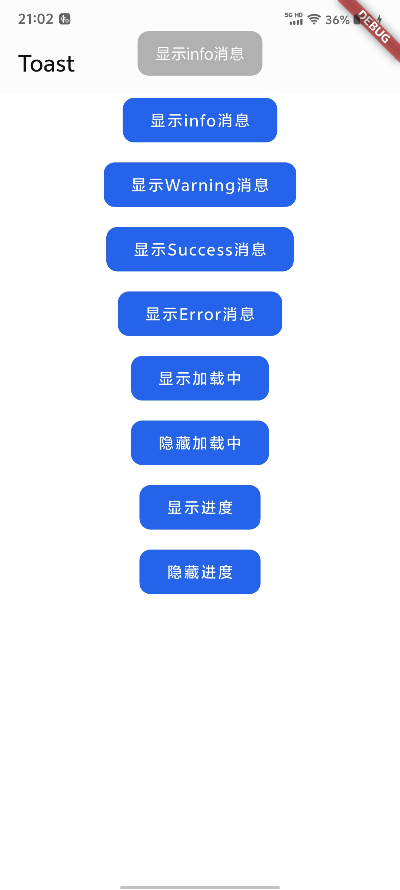
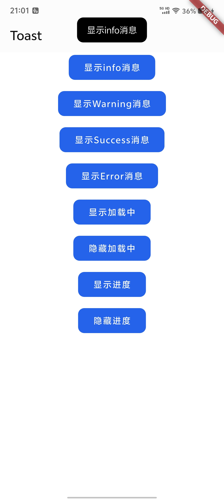
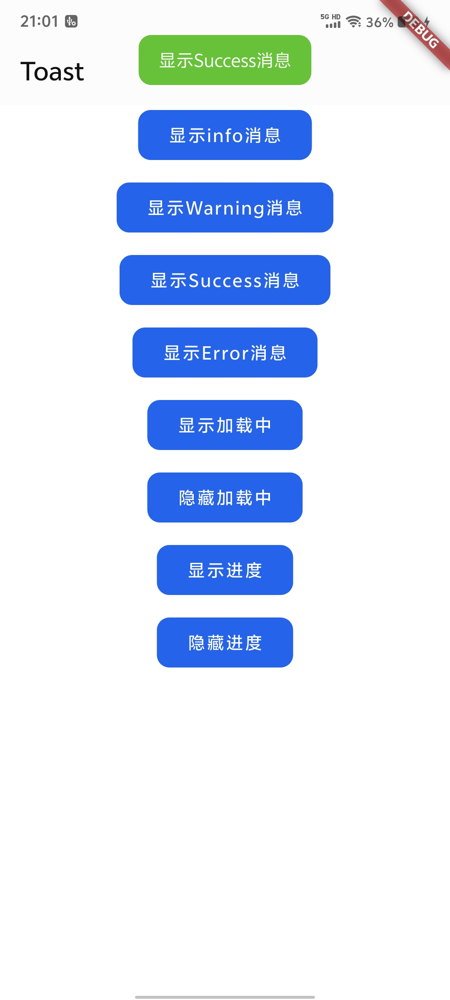
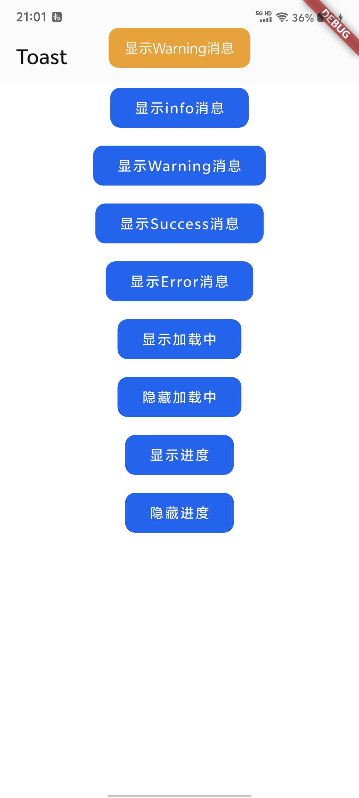
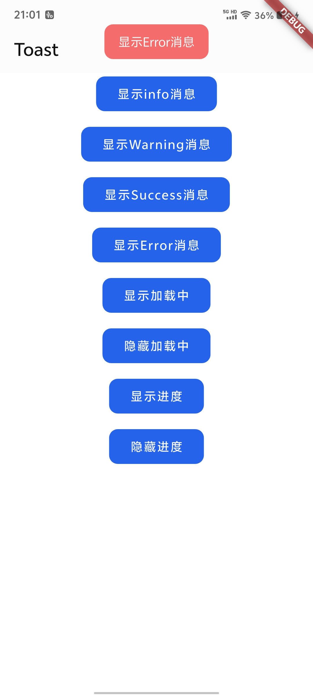
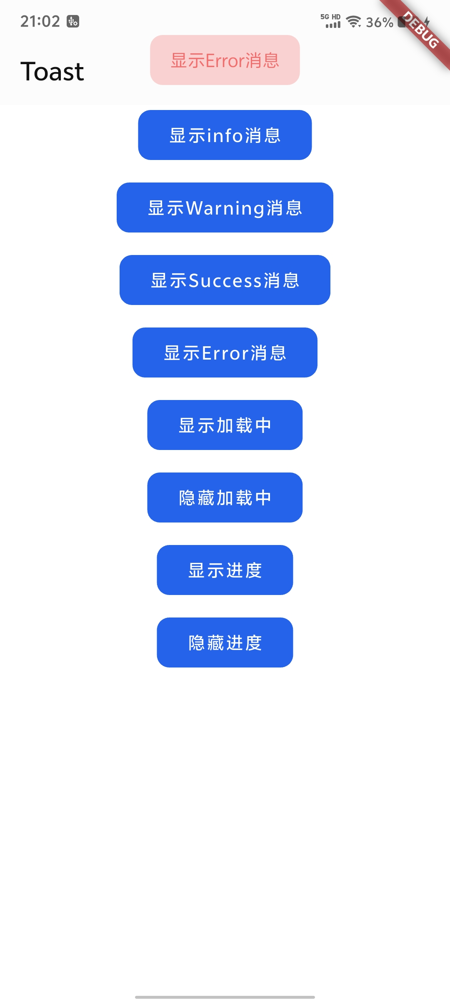
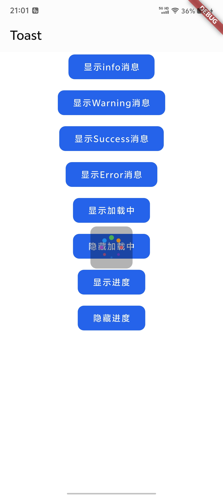
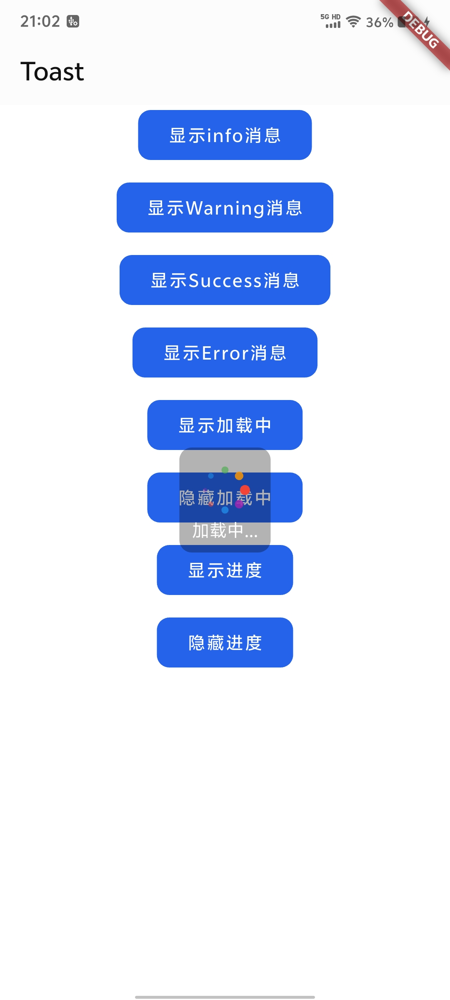
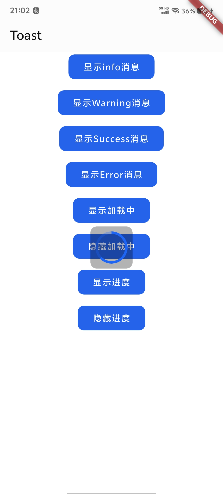
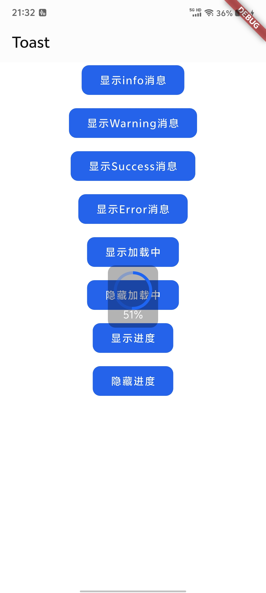

# Flutter Toast Pro

> Lightweight, overlay-based toast / loading / progress utilities driven by `OverlayPortal` and a global `FlutterToastProWrapper`.
> 依托 `OverlayPortal` 与全局 `FlutterToastProWrapper` 的轻量吐司、加载与进度组件。

## ✨ Highlights 功能亮点
- Stateless invocation: wrap the app with `FlutterToastProWrapper`, then call `FlutterToast` anywhere without context.
  通过 `FlutterToastProWrapper` 注入，全局静态方法即可触发，无需上下文传递。
- Built-in presets for info / success / warning / error plus customizable alignment, duration, and extra payload.
  自带 info/success/warning/error 语义色彩，可自由指定对齐、时长与扩展数据。
- Message, loading mask, and determinate progress overlays share the same event bus backed by `rxdart`.
  消息、加载、进度共用 `rxdart` 事件总线，天然适配多页面与多 Navigator 场景。
- Default UI ready to ship; plug in `messageBuilder`, `loadingBuilder`, `progressBuilder` for complete control.
  内置默认样式，亦可通过各类 Builder 自定义展示形态。

## 📦 Installation 安装
Add the dependency manually or run `flutter pub add`:
在 `pubspec.yaml` 中添加依赖，或执行下方命令：

```yaml
dependencies:
  flutter_toast_pro: ^latest
```

```bash
flutter pub add flutter_toast_pro
```

## 🚀 Quick Start 快速开始
1. Wrap your root widget (e.g., `MaterialApp`) with `FlutterToastProWrapper`.
   使用 `FlutterToastProWrapper` 包裹根 Widget（如 `MaterialApp`）。
2. Invoke static helpers such as `FlutterToast.showSuccessMessage` wherever needed.
   在任意位置调用 `FlutterToast` 静态方法即可。

```dart
class MyApp extends StatelessWidget {
  const MyApp({super.key});

  @override
  Widget build(BuildContext context) {
    return FlutterToastProWrapper(
      autoClose: true,
      closeDuration: const Duration(seconds: 3),
      child: MaterialApp(
        title: 'Flutter Toast Demo',
        home: const HomePage(),
      ),
    );
  }
}

class HomePage extends StatelessWidget {
  const HomePage({super.key});

  @override
  Widget build(BuildContext context) {
    return Scaffold(
      body: Center(
        child: FilledButton(
          onPressed: () => FlutterToast.showSuccessMessage('保存成功'),
          child: const Text('显示 Toast'),
        ),
      ),
    );
  }
}
```

## 🔔 Message API 消息接口

| Method / 方法                                                      | Default Type / 默认类型     | Key Params / 主要参数                                        | Notes / 说明                                                                      |
|------------------------------------------------------------------|-------------------------|----------------------------------------------------------|---------------------------------------------------------------------------------|
| `FlutterToast.showMessage`                                       | `MessageType.info`      | `message`, `closeDuration`, `type`, `alignment`, `extra` | Basic toast with configurable semantics and timer. 基础文本吐司，可自定义语义与倒计时。           |
| `showSuccessMessage` / `showWarningMessage` / `showErrorMessage` | Semantic presets / 语义预设 | Same as above / 同上                                       | Sugar helpers that map to success, warning, and error styles. 语法糖，对应成功、警告、错误配色。 |
| `hideMessage()`                                                  | –                       | –                                                        | Manually dismiss the current toast and cancel timers. 手动关闭当前消息并终止定时器。           |

> Alignment defaults to `Alignment.topCenter`; `extra` carries arbitrary payloads for custom builders.
> 默认对齐为 `Alignment.topCenter`，`extra` 可传入任意扩展数据供自定义 Builder 使用。

### Auto Close 自动关闭
- `FlutterToastProWrapper.autoClose`: enable or disable auto dismissal for message toasts (default: true).
  控制是否对消息吐司启用自动关闭（默认启用，仅对 `ToastType.message` 生效）。
- `FlutterToastProWrapper.closeDuration`: global fallback duration, overridable per call.
  全局默认倒计时，可在 `showMessage` 时单独指定。

## ⏳ Loading & Progress 加载与进度

| Method / 方法                                                                                                              | Purpose / 用途                                                  |
|--------------------------------------------------------------------------------------------------------------------------|---------------------------------------------------------------|
| `FlutterToast.showLoading({String? message, AlignmentGeometry alignment, Map<String, dynamic> extra})`                   | Show a modal loading overlay with optional text. 展示可选文案的加载遮罩。 |
| `FlutterToast.hideLoading()`                                                                                             | Hide the active loading overlay. 隐藏当前加载层。                     |
| `FlutterToast.showProgress(double progress, {String? message, AlignmentGeometry alignment, Map<String, dynamic> extra})` | Display determinate progress (0.0–1.0). 展示 0.0~1.0 的确定性进度。    |
| `FlutterToast.hideProgress()`                                                                                            | Dismiss the progress overlay. 关闭进度弹层。                         |

Default widgets appear centered with a modal barrier; feel free to swap in custom builders just like messages.
默认 UI 为屏幕中心的模态遮罩，可像消息一样完全替换为自定义组件。

## 🎨 Custom UI 自定义界面
`FlutterToastProWrapper` exposes three builders. Supply your own widgets to align, animate, or theme the overlays.
三个 Builder 可用于完全定制 UI，以下示例演示如何替换默认消息组件：

```dart
FlutterToastProWrapper(
  messageBuilder: (
    BuildContext context,
    String message,
    MessageType type,
    AlignmentGeometry alignment,
    Map<String, dynamic> extra,
  ) {
    return Align(
      alignment: alignment,
      child: DecoratedBox(
        decoration: BoxDecoration(
          color: Colors.black.withOpacity(0.7),
          borderRadius: BorderRadius.circular(12),
        ),
        child: Padding(
          padding: const EdgeInsets.symmetric(horizontal: 24, vertical: 16),
          child: Text(message, style: const TextStyle(color: Colors.white)),
        ),
      ),
    );
  },
  loadingBuilder: (context, message, alignment, extra) => CustomLoading(message: message),
  progressBuilder: (context, progress, message, alignment, extra) => CustomProgress(value: progress),
  child: MaterialApp(...),
);
```

- The wrapper covers the full screen; align widgets according to the provided `alignment`.
  Wrapper 铺满全屏，根据传入的 `alignment` 自行定位。
- Use `extra` to shuttle icons, callbacks, or analytics IDs to your builder.
  `extra` 可在业务层传入图标、回调 ID 等扩展数据。

## 截图

### Message 消息

| type    | EffectType.primaryLight                            | EffectType.primary                                 |
|---------|----------------------------------------------------|----------------------------------------------------|
| info    |  |  |
| success |  |  |
| waring  |  |  |
| error   |  |  |

### Loading  加载中

|  |  |
|----------------------------------------------------|----------------------------------------------------|

### progress 进度条

|  |  |
|----------------------------------------------------|----------------------------------------------------|


## 📄 License 许可证
Released under the terms described in `LICENSE`.
遵循 `LICENSE` 文件中的开源许可。
